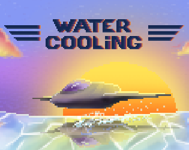

    

‎

<i>
"During the galactic war, your ship was shot and you almost crashed on a foreign planet, 
the attack left the cooling system of your armament heavily damaged,
your weapons are still operational but you will have to rely on the icy ocean of the frozen planet to cool them down,
be careful, staying under water for too long will cause your ship to freeze and sink, good luck commander"
</i>

‎

    

    <h1 align="center">

[Play now on your navigator](https://thalzen.github.io/WaterCooling_Game)

Or

[Access to the game via Itch.io](https://panda13940.itch.io/water-cooling)
</h1>

‎

    Game made by 2 people in 3 days during a GameJam.
    The theme of the GameJam was "1 vs 100" and "Damaged".

